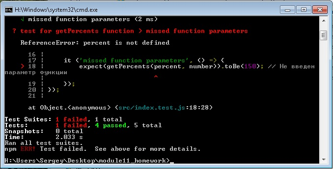

module11_homework

Выполните задания и загрузите решения согласно инструкции в форме ниже.

Задание 1. Настроить тестовое окружение JEST

Можно склонировать репозиторий и вести разработку в нем, либо создать свой собственный.

Задание 2. Выбрать любую реализованную функцию из тренажера JavaScript, раздел «Функции»

        добавить ее в репозиторий;
        продумать тест-кейсы (успешное/неуспешное выполнение функции);
        продумать корнер-кейсы; 
        написать unit-тесты (минимум 3).

Функция которую будем тестировать:

function getPercents(percent, number) {
	return number / 100 * percent;
}

alert( getPercents(30, 200) );

Результат выполнения тестов:

